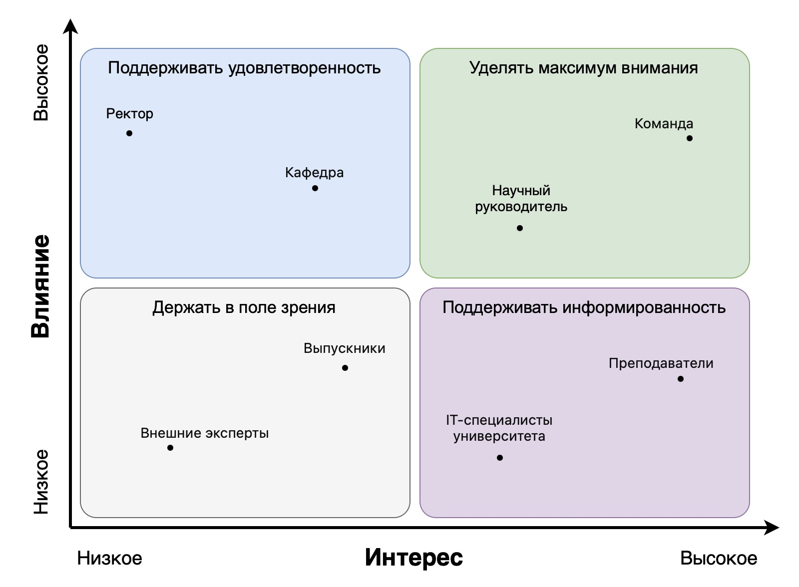
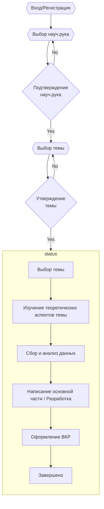
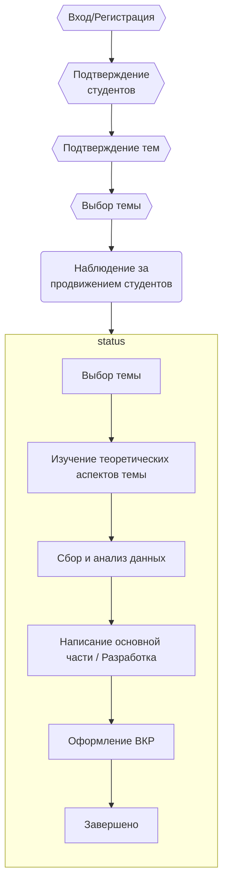
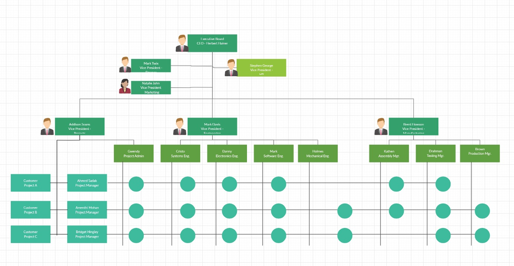

<h1 align="center">Проектный практикум</h1>

## Содержание

Открыть содержание

-   [Матрица ответственности](#Матрица-ответственности)
-   [Examples](#examples)
-   [Release](#release)
-   [Related projects](#related-projects)
-   [Contributors](#contributors---)
-   [Security and safe diagrams](#security-and-safe-diagrams)
-   [Reporting vulnerabilities](#reporting-vulnerabilities)
-   [Appreciation](#appreciation)

## Матрица заинтересованных лиц

<table>
    <tr>
        <th>Результаты проекта</th>
        <th>Роль в проекте / должность</th>
    </tr>
    <tr>
    </tr>
</table>

<a href="./ResponsibilityMatrix.md">more</a>

|               | 1   | 2   | 3   | 4   |
| ------------- | --- | --- | --- | --- |
| Documentation | 25  | 10  | 5   | 25  |
| Programming   | 0   | 15  | 20  | 0   |

Pandoc

**ERP Студента**

**ERP Преподавателя**

